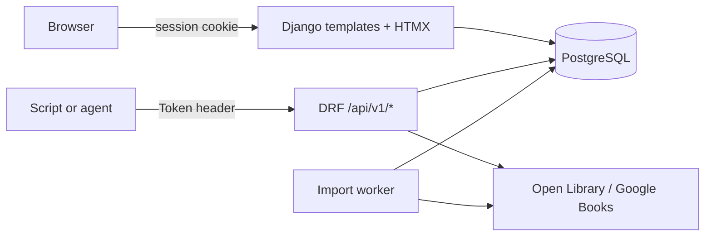

# openbook

**Your books. Your server. Your API.**

MIT · Django 5.2 · Python 3.12+ · PostgreSQL · Docker

---

Goodreads owns your reading history and offers no public API. Most open-source alternatives are dated, buggy, or built only for humans clicking buttons. **openbook** is different: a self-hosted book tracker where the web UI and the REST API are equals—so you can browse your library in a browser *and* let scripts, home automation, or AI agents read and update your shelves.

One account per instance. No open registration. Visit `/setup/` on first run to create your operator account, or use `createsuperuser` from the CLI.

## Why openbook?

| | Goodreads | openbook |
|---|-----------|----------|
| Data ownership | Amazon's servers | Yours |
| Public API | None | Full REST + OpenAPI |
| Privacy | Telemetry, ads | Self-hosted, no telemetry |
| Automation | Scraping hacks | Token auth, JSON envelope |
| Export | Limited | JSON + Goodreads-compatible CSV anytime |

## Features

### Library

- Add books by ISBN with metadata lookup (Open Library, Google Books fallback), **search by title or author** on the add-book form, or manual entry
- Full-text search across your collection; filter by author, genre, shelf, **rating**, or reading status
- **Author pages** (`/authors/`) and **genre browse** (`/genres/<slug>/`) with links from book detail
- Custom shelves as tags plus Goodreads-style status shelves (Want to Read, Currently Reading, Read)
- **External links** on book detail (Open Library, Google Books, Amazon, Goodreads) when metadata IDs are known
- Soft-delete with trash and restore

### Reading life

- Track reading status and daily progress (percent complete, optional page counts)
- **Per-book reading history timeline** (status changes and progress snapshots)
- Rate books and write personal reviews; save **quotes and highlights** with optional page/position
- Stats dashboard: books per month, pages read, completion rate, reading streak, shelf breakdown

### Own your data

- Import from a Goodreads CSV export or an ISBN list (background job queue with live status)
- Export your full library as JSON (full fidelity) or CSV (Goodreads-compatible for round-trip)
- **Library Tools** (`/library-tools/`) — health summary, bulk metadata backfill (Open Library + Google Books + Wikidata), pending match review queue, clear metadata cache, and per-book **Refresh metadata** on book detail
- No third-party analytics, no lock-in

### Built for automation

- REST API with OpenAPI docs at `/api/v1/docs/`
- Token authentication (`Authorization: Token <key>`)
- Health endpoint at `/healthz` for uptime monitoring
- API token visible in Settings (`/settings/`)
- **Public embed widget** — show currently reading or recently finished on a blog or personal site (enable in Settings, optional embed key)

Dark mode (light / dark / system) and a calm, content-first web UI round out the experience.

## Screenshots

Replace these placeholders with real captures from your instance.

| Dashboard | Library |
|-----------|---------|
|  |  |

| API docs |
|----------|
|  |

## Quickstart (local)

Requires [uv](https://docs.astral.sh/uv/) and Python 3.12+.

```bash
uv sync --dev
cp .env.example .env
uv run python manage.py migrate
uv run python manage.py createcachetable
uv run python manage.py runserver
```

Open http://127.0.0.1:8000/ — on first run you will be prompted to create your account at `/setup/`.

CLI fallback: `uv run python manage.py createsuperuser`

### Development

```bash
uv run pytest                  # Run tests
uv run python manage.py check  # Django system check
```

See [CONTRIBUTING.md](CONTRIBUTING.md) for guidelines and [AGENTS.md](AGENTS.md) for the AI build workflow.

## Docker

The bundled [docker-compose.yml](docker-compose.yml) targets production (Traefik reverse proxy, external `web` network). For a self-contained local stack, use something like:

```yaml
# docker-compose.local.yml
services:
  openbook:
    build: .
    ports: ["8000:8000"]
    environment:
      DATABASE_URL: postgres://openbook:openbook@db:5432/openbook
      SECRET_KEY: change-me-in-production
      ALLOWED_HOSTS: localhost,127.0.0.1
      IMPORT_JOB_AUTO_PROCESS: "false"
    depends_on:
      db:
        condition: service_healthy

  worker:
    build: .
    command: ["python", "manage.py", "process_import_jobs", "--loop"]
    environment:
      DATABASE_URL: postgres://openbook:openbook@db:5432/openbook
      SECRET_KEY: change-me-in-production

  db:
    image: postgres:16
    environment:
      POSTGRES_USER: openbook
      POSTGRES_PASSWORD: openbook
      POSTGRES_DB: openbook
    healthcheck:
      test: ["CMD-SHELL", "pg_isready -U openbook -d openbook"]
      interval: 5s
      timeout: 5s
      retries: 5
```

```bash
docker compose -f docker-compose.local.yml up --build -d

# One-time setup (image runs Gunicorn, not migrate)
docker compose -f docker-compose.local.yml exec openbook python manage.py migrate
docker compose -f docker-compose.local.yml exec openbook python manage.py createcachetable
```

Visit http://localhost:8000/setup/ to create your account.

**Import jobs:** With `IMPORT_JOB_AUTO_PROCESS=false` on the web container (Compose default), the `worker` service drains the queue. Local `runserver` auto-processes jobs in a background thread instead.

**Metadata enrichment:** Set `OPENLIBRARY_CONTACT_EMAIL` for identified Open Library requests (3 req/s). Goodreads CSV imports enrich metadata by default (`IMPORT_GOODREADS_ENRICH_METADATA=true`) from Open Library, Google Books, and Wikidata. Books without ISBN use title+author search; uncertain matches appear on **Library Tools** for review. Bulk backfill fills only empty fields; **Refresh metadata** on a book detail page can overwrite cover, pages, authors, genres, and other provider fields.

**Production:** Use the repo's [docker-compose.yml](docker-compose.yml) with your `.env` (`SECRET_KEY`, `ALLOWED_HOSTS`, `CSRF_TRUSTED_ORIGINS`, `CORS_ALLOWED_ORIGINS`). Ensure the external `web` Docker network exists before `docker compose up`.

## API at a glance

```bash
# Get a token
curl -s -X POST http://127.0.0.1:8000/api/v1/auth/login/ \
  -H "Content-Type: application/json" \
  -d '{"email": "you@example.com", "password": "your-password"}'
# → {"data": {"token": "abc123..."}}

# List your books (optional filters: ?rating=5&status=reading&genre=fantasy)
curl -s http://127.0.0.1:8000/api/v1/books/ \
  -H "Authorization: Token abc123..."

# Search metadata by title or author (add-book helper)
curl -s "http://127.0.0.1:8000/api/v1/books/search-metadata/?q=dune" \
  -H "Authorization: Token abc123..."

# Reading history for a book
curl -s http://127.0.0.1:8000/api/v1/books/<book-id>/reading/history/ \
  -H "Authorization: Token abc123..."

# Public embed JSON (no auth; enable embed + key in Settings first)
curl -s "http://127.0.0.1:8000/api/v1/embed/?key=YOUR_EMBED_KEY&kind=currently_reading"

# Interactive docs
open http://127.0.0.1:8000/api/v1/docs/
```

Your API token is also shown on the Settings page in the web UI. Full endpoint reference: [docs/02-TRD-Technical-Requirements-Document.md](docs/02-TRD-Technical-Requirements-Document.md) §4.

## Architecture

Two surfaces, one database:



| Layer | Choice |
|-------|--------|
| Backend | Django 5.2, Django REST Framework, PostgreSQL |
| Web UI | Django templates, HTMX, Tailwind CSS |
| API docs | drf-spectacular (OpenAPI 3) |
| Deploy | Gunicorn, WhiteNoise, Docker |

## Documentation

See [docs/README.md](docs/README.md) for a full index by audience.

| Doc | Description |
|-----|-------------|
| [docs/01-PRD-Product-Requirements-Document.md](docs/01-PRD-Product-Requirements-Document.md) | Product requirements |
| [docs/02-TRD-Technical-Requirements-Document.md](docs/02-TRD-Technical-Requirements-Document.md) | Technical requirements & API spec |
| [docs/03-UI-UX-Design.md](docs/03-UI-UX-Design.md) | UI/UX design |
| [docs/05-Backend-Schema.md](docs/05-Backend-Schema.md) | Database schema |
| [docs/06-Implementation-Plan.md](docs/06-Implementation-Plan.md) | Build phases |
| [docs/07-Architecture-and-Code-Map.md](docs/07-Architecture-and-Code-Map.md) | Codebase layout & module map (contributors) |
| [docs/08-Operations-and-Deployment.md](docs/08-Operations-and-Deployment.md) | Deployment runbook (operators) |
| [docs/09-API-Consumer-Guide.md](docs/09-API-Consumer-Guide.md) | API integration walkthroughs |
| [docs/10-Import-and-Metadata-Pipeline.md](docs/10-Import-and-Metadata-Pipeline.md) | Import jobs & metadata lookup |

## License

MIT — see [LICENSE](LICENSE).
