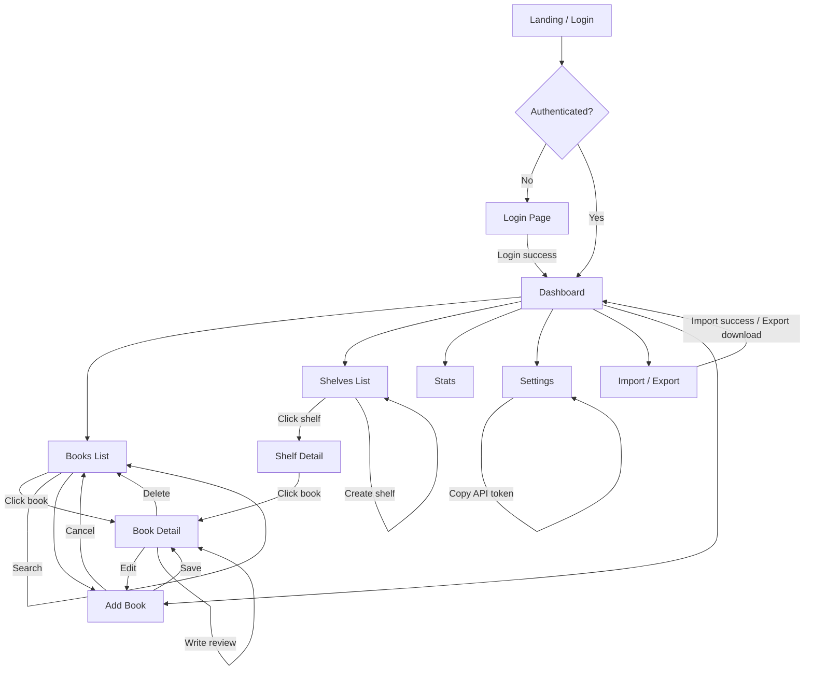

# AppFlow — Application Flow Diagram

**Status:** Draft | **Owner:** John | **Last updated:** 2026-06-22

---

## 1. Navigation Map



---

## 2. Screen-by-Screen Flow

### Auth Flow

```
[Landing Page]
     │
     └──→ [Login] ──success──→ [Dashboard]
             │
             └──→ Forgot password? → operator resets via `manage.py changepassword` / Django admin
                                      (no email-based reset in MVP — single-user)
```

- **Single-user:** No registration screen. The sole account is created by the operator via `createsuperuser` / Django admin (see TRD §4)
- **Auth gates:** Every page except Login requires authentication
- **Session:** Django session-based auth for browser; token-based for API
- **Expiry:** Session expires on browser close; no "remember me" in MVP

### Dashboard Flow

```
[Dashboard]
     │
     ├──→ "Currently Reading" cards ──click──→ [Book Detail]
     ├──→ Quick stats cards (read-only) 
     ├──→ Recent additions list ──click──→ [Book Detail]
     ├──→ Sidebar "Books" ──→ [Books List]
     ├──→ Sidebar "Shelves" ──→ [Shelves List]
     ├──→ Sidebar "Stats" ──→ [Stats]
     ├──→ Sidebar "Import / Export" ──→ [Import / Export]
     └──→ Sidebar "Settings" ──→ [Settings]
```

### Books List Flow

```
[Books List]
     │
     ├──→ Search bar ──type──→ live filtered results
     ├──→ Filters: Shelf dropdown, Genre dropdown, Status dropdown, Sort dropdown
     ├──→ "+ Add Book" button ──→ [Add Book]
     ├──→ Book item ──click──→ [Book Detail]
     └──→ Pagination controls
```

- **Empty state:** "Your library is empty. Add your first book!" + prominent "Add Book" CTA
- **Search:** Real-time HTMX search (title, author, ISBN). Falls back to full-text search

### Book Detail Flow

```
[Book Detail]
     │
     ├──→ Cover image (placeholder if none)
     ├──→ Title, Author, Metadata
     ├──→ Rating: ⭐⭐⭐ display + click to rate
     ├──→ Status bar: [Not Started | Reading | Finished | Paused | DNF]
     │       └──→ If Reading: 45% complete (p.158 / 350)  [Edit] ──inline──→ update
     │             └──→ updating progress records a ReadingProgress entry (for streak/charts)
     ├──→ Shelves: displayed as tags, [+ Add] ──modal──→ select shelf
     │       └──→ Click shelf tag ──→ [Shelf Detail]
     ├──→ Review section: text area, save
     ├──→ "Edit" button ──→ [Add Book] (pre-filled)
     ├──→ "Delete" button ──confirmation──→ soft delete (to Trash) → redirect to [Books List] (with "Undo")
     └──→ Description / synopsis block
```

### Shelves Flow

```
[Shelves List]
     │
     ├──→ List of shelves with book count
     ├──→ "Create Shelf" ──inline form──→ name input → save
     ├──→ Shelf item ──click──→ [Shelf Detail]
     └──→ Shelf options ⋮ ──→ Rename / Delete

[Shelf Detail]
     │
     ├──→ Shelf name + book count
     ├──→ Books on this shelf (paginated list)
     ├──→ Click book ──→ [Book Detail]
     └──→ Edit shelf name / Delete shelf
```

### Add Book Flow

```
[Add Book]
     │
     ├──→ Option A: Search by ISBN (Open Library)
     │       └──→ Enter ISBN → GET /api/v1/books/lookup/?isbn= → Open Library
     │             └──→ found → pre-fill form (title, authors, cover, pages, published)
     │             │        └──→ review/edit → Save → [Book Detail]
     │             └──→ not found / Open Library unreachable → fall back to manual entry
     │
     ├──→ Option B: Manual entry
     │       └──→ Title*, Author*, ISBN, Pages, Published year, Genres, Description, Cover URL
     │           └──→ Save → redirect to [Book Detail]
     │
     └──→ Cancel → back to previous page
```

\*Required fields. ISBN lookup uses Open Library (no API key) and degrades gracefully to manual entry if the lookup fails (see TRD §6).

### Import / Export Flow

```
[Import / Export]
     │
     ├──→ Import
     │     ├──→ Option A: Paste ISBNs (one per line)
     │     ├──→ Option B: Upload CSV file (Goodreads export format)
     │     │       └──→ Parse → Validate → Show preview of N books found (+ duplicates skipped)
     │     │           └──→ Confirm import → Process → Show results (added / skipped / failed)
     │     └──→ Cancel → back to [Dashboard]
     │
     └──→ Export
           ├──→ "Export JSON" → download full-fidelity collection (.json)
           └──→ "Export CSV"  → download Goodreads-compatible collection (.csv)
```

### Stats Flow

```
[Stats]
     │
     ├──→ Total Books, Total Pages, Books Read This Year
     ├──→ Books read per month (bar chart — ASCII or JS chart)
     ├──→ Shelf breakdown (pie/donut chart)
     ├──→ Genre breakdown (pie/donut chart)
     ├──→ Reading streak (consecutive days with reading activity — from ReadingProgress)
     └──→ Currently Reading count
```

### Settings Flow

```
[Settings]
     │
     ├──→ Profile: Name, Email
     ├──→ Change password
     ├──→ Timezone (drives reading-day boundaries / streaks)
     ├──→ API Token: [display token] [Regenerate]
     ├──→ Data: [Export JSON] [Export CSV] · link to [Import / Export]
     └──→ Theme / preferences (future)
```

---

## 3. Error & Edge Case Paths

| Scenario | Behaviour |
|----------|-----------|
| **Login fails** | Error message on login form: "Invalid email or password" |
| **Network error** | Toast notification: "Connection error. Please check your connection." |
| **Book not found** | 404 page with "Book not found" and link back to Books list |
| **Duplicate ISBN** | On import/add: "This book is already in your collection" — skips duplicate |
| **Invalid CSV** | Error message listing specific rows that failed validation |
| **Empty shelf** | "This shelf is empty. Add books from your library." |
| **Delete last book on shelf** | Shelf still exists, just shows empty state |
| **Delete shelf with books** | Books remain in library, just removed from that shelf |
| **Delete a book** | Soft delete → moves to Trash (recoverable). "Undo" toast immediately; Trash offers Restore / Delete permanently |
| **Import an ISBN that's in Trash** | Reported as duplicate; offer to restore the trashed book instead of creating a new one |
| **Rate limit (API)** | 429 response with retry-after header |

## 4. Auth Gates

| Screen | Requires Auth? |
|--------|:---:|
| Landing / Login | No |
| Dashboard | Yes |
| Books List | Yes |
| Book Detail | Yes |
| Add Book | Yes |
| Shelves | Yes |
| Shelf Detail | Yes |
| Stats | Yes |
| Import / Export | Yes |
| Settings | Yes |
| All API endpoints | Yes (token required) |
