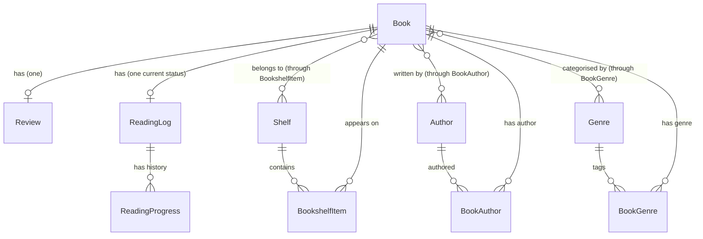

# Backend Schema — openbook

**Status:** Draft | **Owner:** John | **Last updated:** 2026-06-22

---

## 1. Entity Relationship Diagram

openbook is **single-user**: there is exactly one `User` (the operator) per instance. The `User` entity is shown for completeness, but because every row implicitly belongs to that one account, most tables do **not** carry a per-user foreign key (see notes on each table). The relationships that would be needed for a future multi-user variant are noted inline.



---

## 2. Tables

### `accounts_user` (custom user model)

Custom user model in an `accounts` app, extending `AbstractUser` with **`email` as the `USERNAME_FIELD`** — login by email only, **no `username` column**. Because openbook is single-user, this table holds exactly one row in normal operation.

| Column | Type | Constraints |
|--------|------|-------------|
| id | serial | PK |
| password | varchar(128) | NOT NULL |
| last_login | timestamptz | NULL |
| is_superuser | boolean | NOT NULL, DEFAULT false |
| first_name | varchar(150) | NOT NULL, DEFAULT '' |
| last_name | varchar(150) | NOT NULL, DEFAULT '' |
| email | varchar(254) | NOT NULL, UNIQUE |
| is_staff | boolean | NOT NULL, DEFAULT false |
| is_active | boolean | NOT NULL, DEFAULT true |
| date_joined | timestamptz | NOT NULL |

> **Note:** The custom model sets `USERNAME_FIELD = "email"`, `REQUIRED_FIELDS = []`, and removes the `username` field. The single account is created via `createsuperuser`; there is no self-service registration (see TRD §4).

### `books_book`

Core book entity. Stores bibliographic metadata.

| Column | Type | Constraints | Notes |
|--------|------|-------------|-------|
| id | uuid | PK, DEFAULT gen_random_uuid() | UUID for API-friendly IDs |
| title | varchar(500) | NOT NULL | |
| subtitle | varchar(500) | NULL | |
| isbn_13 | varchar(13) | NULL, UNIQUE INDEX | 13-digit ISBN |
| isbn_10 | varchar(10) | NULL, UNIQUE INDEX | 10-digit ISBN |
| pages | integer | NULL, CHECK >= 0 | |
| published_year | smallint | NULL | Publication year (metadata sources usually give year only) |
| published_date | date | NULL | Full publication date — only when precisely known |
| publisher | varchar(500) | NULL | |
| description | text | NULL | |
| cover_url | varchar(2000) | NULL | URL to cover image (often an Open Library cover URL) |
| language | varchar(10) | NULL, DEFAULT 'en' | ISO 639-1 code |
| search_vector | tsvector | NULL | PostgreSQL full-text search index |
| deleted_at | timestamptz | NULL | Soft-delete marker — non-null means "in Trash" (recoverable) |
| created_at | timestamptz | NOT NULL, DEFAULT now() | |
| updated_at | timestamptz | NOT NULL, DEFAULT now() | |

> **Single-user note:** an `owner_id` FK is intentionally omitted — there is one account, so every book belongs to it. For a future multi-user variant, add `owner_id integer NOT NULL FK → accounts_user.id` plus an `idx_book_owner` index, and scope ISBN uniqueness per owner.

> **Soft delete:** Deleting a book sets `deleted_at` (moves it to Trash) instead of removing the row, satisfying the "zero data loss" principle. The default model manager excludes soft-deleted rows; a Trash view lists them with **Restore** and **Delete permanently** actions. Permanent delete cascades to reviews/reading logs/progress/shelf items as documented. Note: a soft-deleted book still occupies its unique ISBN — restoring is always safe; importing the same ISBN while it's in Trash reports it as a duplicate (offer restore).

**Indexes:**
- `idx_book_isbn_13` — UNIQUE on `isbn_13` (WHERE isbn_13 IS NOT NULL)
- `idx_book_isbn_10` — UNIQUE on `isbn_10` (WHERE isbn_10 IS NOT NULL)
- `idx_book_title_trgm` — GIN trigram index on `title` for fuzzy search
- `idx_book_search` — GIN index on `search_vector` for full-text search
- `idx_book_created` — on `created_at DESC`
- `idx_book_active` — partial index `WHERE deleted_at IS NULL` for fast active-book listing

### `books_author`

Normalised author table (avoids duplicate author names).

| Column | Type | Constraints |
|--------|------|-------------|
| id | serial | PK |
| name | varchar(500) | NOT NULL |
| sort_name | varchar(500) | NULL | "Last, First" for alphabetical sorting |
| created_at | timestamptz | NOT NULL, DEFAULT now() |

**Indexes:**
- `idx_author_name` — on `name`
- `idx_author_sort_name` — on `sort_name`

### `books_bookauthor`

Junction table — many-to-many between Book and Author (a book can have multiple authors, an author can write many books). Also supports `role` and `position` for ordering.

| Column | Type | Constraints | Notes |
|--------|------|-------------|-------|
| id | serial | PK | |
| book_id | uuid | NOT NULL, FK → books_book.id, ON DELETE CASCADE | |
| author_id | integer | NOT NULL, FK → books_author.id, ON DELETE CASCADE | |
| role | varchar(50) | NULL, DEFAULT 'author' | "author", "editor", "translator", "illustrator" |
| position | smallint | NOT NULL, DEFAULT 0 | Order of authors (1 = primary) |

**Indexes:**
- `idx_bookauthor_book` — on `book_id`
- `idx_bookauthor_author` — on `author_id`
- **UNIQUE** — on `(book_id, author_id, role)`

### `books_genre`

Normalised genre/category table. Backs the "Genres" shown on the Book Detail screen and genre filtering on the Books list.

> **Source:** genres are **seeded automatically from Open Library subjects** when a book is added/looked up (deduped by `slug`), and remain **fully user-editable** (rename, add, remove, detach). The user's edits always win over re-imported subjects.

| Column | Type | Constraints | Notes |
|--------|------|-------------|-------|
| id | serial | PK | |
| name | varchar(100) | NOT NULL, UNIQUE | e.g. "Fiction", "Drama", "Non-Fiction" |
| slug | varchar(120) | NOT NULL, UNIQUE | URL-friendly identifier |
| source | varchar(20) | NOT NULL, DEFAULT 'user' | `open_library` (auto-seeded) or `user` (manually created) |
| created_at | timestamptz | NOT NULL, DEFAULT now() | |

**Indexes:**
- `idx_genre_slug` — UNIQUE on `slug`
- `idx_genre_name` — UNIQUE on `name`

### `books_bookgenre`

Junction table — many-to-many between Book and Genre.

| Column | Type | Constraints |
|--------|------|-------------|
| id | serial | PK |
| book_id | uuid | NOT NULL, FK → books_book.id, ON DELETE CASCADE |
| genre_id | integer | NOT NULL, FK → books_genre.id, ON DELETE CASCADE |

**Indexes:**
- `idx_bookgenre_book` — on `book_id`
- `idx_bookgenre_genre` — on `genre_id`
- **UNIQUE** — on `(book_id, genre_id)`

### `books_shelf`

Fully custom, user-created tags for organising books (e.g. "Favourites", "2026 Reads", "Sci-Fi TBR").

> **Shelves are NOT reading status.** Reading state (want to read / reading / read / paused / DNF) is owned exclusively by `books_readinglog.status` (see below). Shelves are arbitrary tags only — there are **no system/default shelves** and the app does not auto-create "Read/Reading/Want to Read" shelves. This avoids the Goodreads-style drift where a book's shelf and its status disagree.

| Column | Type | Constraints | Notes |
|--------|------|-------------|-------|
| id | serial | PK | |
| name | varchar(200) | NOT NULL | e.g. "Favourites", "2026 Reads" |
| description | text | NULL | Optional description of the shelf |
| color | varchar(7) | NULL | Hex color for UI tag display |
| sort_order | smallint | NOT NULL, DEFAULT 0 | Display order |
| created_at | timestamptz | NOT NULL, DEFAULT now() | |

> **Single-user note:** no `owner_id` — all shelves belong to the one account. Multi-user variant: add `owner_id FK → accounts_user.id` and make the unique constraint `(owner_id, name)`.

**Indexes:**
- **UNIQUE** — on `name`

### `books_bookshelfitem`

Junction table connecting books to shelves.

| Column | Type | Constraints |
|--------|------|-------------|
| id | serial | PK |
| book_id | uuid | NOT NULL, FK → books_book.id, ON DELETE CASCADE |
| shelf_id | integer | NOT NULL, FK → books_shelf.id, ON DELETE CASCADE |
| added_at | timestamptz | NOT NULL, DEFAULT now() |

**Indexes:**
- `idx_bsi_book` — on `book_id`
- `idx_bsi_shelf` — on `shelf_id`
- **UNIQUE** — on `(book_id, shelf_id)` — a book can only be on a shelf once

### `books_review`

User's rating and written review for a book.

| Column | Type | Constraints | Notes |
|--------|------|-------------|-------|
| id | serial | PK | |
| book_id | uuid | NOT NULL, FK → books_book.id, ON DELETE CASCADE | |
| rating | smallint | NULL, CHECK 1-5 | Null = not rated yet |
| review_text | text | NULL | Free-form notes/review |
| created_at | timestamptz | NOT NULL, DEFAULT now() | |
| updated_at | timestamptz | NOT NULL, DEFAULT now() | |

> **Single-user note:** no `user_id` — one review per book (the operator's). Multi-user variant: add `user_id FK → accounts_user.id` and make the unique constraint `(book_id, user_id)`.

**Indexes:**
- `idx_review_book` — on `book_id`
- **UNIQUE** — on `book_id` — one review per book

### `books_readinglog`

The **canonical reading state** of a book (one row per book). This is the single source of truth for whether a book is unread, in progress, finished, paused, or abandoned — shelves do not encode status. Per-day progress history lives in `books_readingprogress` (below).

| Column | Type | Constraints | Notes |
|--------|------|-------------|-------|
| id | serial | PK | |
| book_id | uuid | NOT NULL, FK → books_book.id, ON DELETE CASCADE | |
| status | varchar(20) | NOT NULL, DEFAULT 'not_started' | Enum: not_started, reading, finished, paused, abandoned |
| current_page | integer | NULL, CHECK >= 0 | Latest page reached (optional; some books have no page count) |
| progress_percent | smallint | NULL, CHECK 0-100 | Percent complete — the primary progress measure (works for books with no page count) |
| total_pages | integer | NULL, CHECK >= 0 | Denormalised from book for historical accuracy |
| read_count | smallint | NOT NULL, DEFAULT 0 | Times finished (incremented on each finish; supports re-reads) |
| started_at | date | NULL | When the current read started |
| finished_at | date | NULL | When most recently finished |
| updated_at | timestamptz | NOT NULL, DEFAULT now() | |

> **Single-user note:** no `user_id` — one reading log per book. Multi-user variant: add `user_id FK → accounts_user.id` and make the unique constraint `(book_id, user_id)`.

**Status lifecycle** (enforced in the serializer/service layer):

- A `ReadingLog` row is **auto-created with status `not_started`** when a book is added (no separate "Want to Read" shelf needed).
- `not_started -> reading`: set `started_at = today` if empty.
- `reading -> finished`: set `finished_at = today`, set `progress_percent = 100` (and `current_page = total_pages` when known), increment `read_count`.
- `reading -> paused` / `reading -> abandoned`: status only.
- `finished -> reading` (re-read): clear `finished_at`, set `started_at = today`; on next finish, `read_count` increments again. Full per-read history is post-MVP (see PRD Future).

**Indexes:**
- `idx_reading_book` — on `book_id`
- `idx_reading_status` — on `status`
- **UNIQUE** — on `book_id` — one reading log per book

### `books_readingprogress`

Append-only history of reading progress events. Enables the **reading streak** (consecutive days with activity) and progress-over-time charts on the Stats screen, which the single-row `ReadingLog` cannot express.

| Column | Type | Constraints | Notes |
|--------|------|-------------|-------|
| id | serial | PK | |
| reading_log_id | integer | NOT NULL, FK → books_readinglog.id, ON DELETE CASCADE | The book's reading log |
| book_id | uuid | NOT NULL, FK → books_book.id, ON DELETE CASCADE | Denormalised for fast per-book/date queries |
| logged_on | date | NOT NULL, DEFAULT current_date | Local-timezone day this progress was recorded (drives streak; uses `TIME_ZONE`, not UTC) |
| current_page | integer | NULL, CHECK >= 0 | Page reached as of this entry (optional) |
| progress_percent | smallint | NULL, CHECK 0-100 | Percent complete as of this entry |
| pages_read | integer | NULL, CHECK >= 0 | Pages read in this entry (for "pages per day/month") |
| note | varchar(280) | NULL | Optional short note |
| created_at | timestamptz | NOT NULL, DEFAULT now() | |

**Indexes:**
- `idx_progress_log` — on `reading_log_id`
- `idx_progress_book_date` — on `(book_id, logged_on)`
- `idx_progress_logged_on` — on `logged_on` (streak/monthly aggregation)

---

## 3. Enums

Defined as Django `TextChoices` (stored as varchar in DB).

```python
class ReadingStatus(models.TextChoices):
    NOT_STARTED = "not_started", "Not Started"
    READING = "reading", "Currently Reading"
    FINISHED = "finished", "Finished"
    PAUSED = "paused", "Paused"
    ABANDONED = "abandoned", "DNF"

class AuthorRole(models.TextChoices):
    AUTHOR = "author", "Author"
    EDITOR = "editor", "Editor"
    TRANSLATOR = "translator", "Translator"
    ILLUSTRATOR = "illustrator", "Illustrator"
```

---

## 4. Migration Plan

| Migration | Changes |
|-----------|---------|
| 001 | Custom User model (email-based auth, no username) |
| 002 | Book + Author + BookAuthor tables |
| 003 | Genre + BookGenre tables |
| 004 | Shelf + BookshelfItem tables |
| 005 | Review table |
| 006 | ReadingLog table |
| 007 | ReadingProgress table |
| 008 | Full-text search index + triggers on Book |

All migrations use Django's built-in migration framework. Never raw SQL unless required for Postgres-specific features (full-text search triggers).

---

## 5. Django Model Example (for reference)

```python
from django.db import models
from django.contrib.postgres.indexes import GinIndex
from django.contrib.postgres.search import SearchVectorField

class Book(models.Model):
    id = models.UUIDField(primary_key=True, default=uuid.uuid4, editable=False)
    title = models.CharField(max_length=500)
    subtitle = models.CharField(max_length=500, blank=True, null=True)
    isbn_13 = models.CharField(max_length=13, unique=True, null=True, blank=True)
    isbn_10 = models.CharField(max_length=10, unique=True, null=True, blank=True)
    pages = models.IntegerField(null=True, blank=True)
    published_year = models.SmallIntegerField(null=True, blank=True)
    published_date = models.DateField(null=True, blank=True)  # only when fully known
    publisher = models.CharField(max_length=500, blank=True, null=True)
    description = models.TextField(blank=True, null=True)
    cover_url = models.URLField(max_length=2000, blank=True, null=True)
    language = models.CharField(max_length=10, default='en')

    authors = models.ManyToManyField(Author, through='BookAuthor')
    genres = models.ManyToManyField('Genre', through='BookGenre', blank=True)
    # Single-user: no owner FK. For a multi-user variant, add:
    #   owner = models.ForeignKey(settings.AUTH_USER_MODEL,
    #                             on_delete=models.CASCADE, related_name='books')

    # Full-text search
    search_vector = SearchVectorField(null=True, editable=False)

    created_at = models.DateTimeField(auto_now_add=True)
    updated_at = models.DateTimeField(auto_now=True)

    class Meta:
        indexes = [
            GinIndex(fields=['search_vector']),
            GinIndex(name='idx_book_title_trgm',
                     fields=['title'],
                     opclasses=['gin_trgm_ops']),
        ]
```
