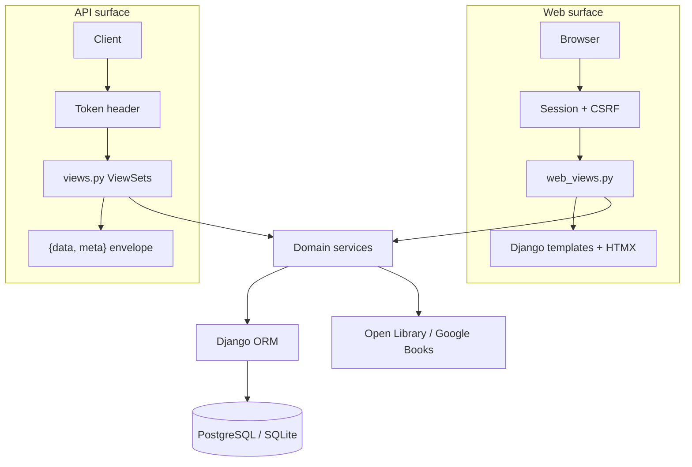

# Architecture and Code Map — openbook

**Status:** Living doc | **Last updated:** 2026-06-25

---

Maps the implemented Django codebase to the schema ([05-Backend-Schema.md](05-Backend-Schema.md)) and API spec ([02-TRD §4](02-TRD-Technical-Requirements-Document.md)). For deployment and env vars see [08-Operations-and-Deployment.md](08-Operations-and-Deployment.md). For import/metadata internals see [10-Import-and-Metadata-Pipeline.md](10-Import-and-Metadata-Pipeline.md).

---

## 1. Project layout

```
openbook/                 # Django project package (settings, URLs, API helpers)
accounts/                 # Single-user auth and operator profile
books/                    # Core domain: models, API, web UI, import, metadata
templates/                # Django HTML templates (HTMX partials, components)
tests/                    # pytest suite (17 modules)
static/                   # Root static placeholder; app static in books/static/
media/                    # User uploads (import job CSV files)
manage.py                 # Django CLI entrypoint
conftest.py               # Shared pytest fixtures
pyproject.toml + uv.lock  # Dependencies (uv)
```

| Directory | Purpose |
|-----------|---------|
| `openbook/` | Project wiring: `settings.py`, root `urls.py`, WSGI/ASGI, health check, CSP middleware, API envelope helpers |
| `accounts/` | Custom `User` (email login), `UserProfile`, setup/login web views, API auth, first-run middleware, timezone middleware |
| `books/` | All book-tracking logic: ORM models, DRF viewsets, HTMX web views, import queue, metadata clients, stats, embed |
| `templates/` | Shared layouts (`base.html`, `auth_layout.html`) and per-feature templates under `books/`, `accounts/` |
| `tests/` | Integration and unit tests; mocks external HTTP (no live Open Library) |

---

## 2. Two-surface architecture

openbook exposes **two HTTP surfaces** over a **shared service/ORM layer**. Behaviour must stay in parity between them (API-first principle from the PRD).



| Aspect | Web surface | API surface |
|--------|-------------|-------------|
| Entry | `books/web_views.py`, `accounts/web_views.py` | `books/views.py`, `accounts/api.py` |
| Auth | Django session cookie + CSRF | `Authorization: Token <key>` |
| Response | HTML (full pages + HTMX partials) | JSON with `{data, meta}` or `{error}` envelope |
| Throttling | N/A | DRF throttling (`API_THROTTLE_RATES`) |
| Token | Not used | Created at login; visible in Settings UI |

---

## 3. URL routing map

### Root (`openbook/urls.py`)

| Path | Handler | Notes |
|------|---------|-------|
| `/healthz` | `HealthCheckView` | DB connectivity probe |
| `/admin/` | Django admin | |
| `/` | `books.web_urls` | Dashboard and library UI |
| `/setup/`, `/login/`, `/logout/` | `accounts.web_urls` | First-run and auth |
| `/api/v1/auth/login/` | `LoginView` | Returns API token |
| `/api/v1/auth/logout/` | `LogoutView` | Invalidates token |
| `/api/v1/schema/` | drf-spectacular | OpenAPI 3 schema |
| `/api/v1/docs/` | Swagger UI | Interactive API docs |
| `/api/v1/stats/` | `StatsView` | Reading statistics |
| `/api/v1/import/` | `ImportView` | Queue import job |
| `/api/v1/import/jobs/<uuid>/` | `ImportJobDetailView` | Poll job status / confirm CSV |
| `/api/v1/export/` | `ExportView` | JSON or CSV download |
| `/api/v1/embed/` | `EmbedView` | Public embed JSON (key auth) |
| `/api/v1/books/`, `/authors/`, `/genres/`, `/quotes/`, `/shelves/` | DRF router | ViewSets |

### Web UI (`books/web_urls.py`)

| Path | View | Purpose |
|------|------|---------|
| `/` | `DashboardView` | Home / reading overview |
| `/books/` | `BookListView` | Library with search and filters |
| `/books/add/` | `BookCreateView` | Add book form |
| `/books/lookup/` | `isbn_lookup` | HTMX ISBN metadata lookup |
| `/books/search-metadata/` | `metadata_search` | HTMX title/author search |
| `/books/<uuid>/` | `BookDetailView` | Book detail, reading, review, quotes |
| `/books/<uuid>/edit/` | `BookUpdateView` | Edit metadata |
| `/books/<uuid>/delete/` | `book_soft_delete` | Move to trash |
| `/books/<uuid>/shelve/`, `/unshelve/` | shelf actions | Custom shelf tags |
| `/books/<uuid>/review/`, `/reading/`, `/quotes/` | per-book actions | |
| `/books/<uuid>/refresh-metadata/` | `book_refresh_metadata` | Queues `metadata_refresh` job |
| `/authors/`, `/authors/<id>/` | author pages | |
| `/genres/<slug>/` | `GenreDetailView` | Genre browse |
| `/shelves/` | `ShelfListView` | Custom + status shelves |
| `/shelves/status/<slug>/` | `StatusShelfDetailView` | Virtual Goodreads-style shelf |
| `/shelves/<id>/` | `ShelfDetailView` | Custom shelf detail |
| `/trash/` | `TrashListView` | Soft-deleted books |
| `/settings/` | `SettingsView` | Profile, token, embed |
| `/library-tools/` | `LibraryToolsView` | Health + bulk backfill |
| `/stats/` | `StatsPageView` | Stats dashboard |
| `/import-export/` | `ImportExportView` | CSV/ISBN import, export |
| `/import-export/jobs/<uuid>/` | import job detail + HTMX status | |
| `/embed/widget.js` | `embed_widget` | Public embed script |

### Accounts web (`accounts/web_urls.py`)

| Path | View |
|------|------|
| `/setup/` | `SetupView` — creates sole superuser on first run |
| `/login/` | `EmailLoginView` |
| `/logout/` | `WebLogoutView` |

---

## 4. Module responsibility map

### `books/` app

| Module | Responsibility |
|--------|----------------|
| `models.py` | `Book`, `Author`, `Genre`, `Shelf`, `Review`, `ReadingLog`, `ReadingProgress`, `Quote`, `ImportJob`; soft-delete manager; PostgreSQL full-text search |
| `views.py` | DRF ViewSets (`Book`, `Author`, `Genre`, `Quote`, `Shelf`), import/export/embed/stats API views |
| `serializers.py` | Request/response serializers for API |
| `filters.py` | `django-filter` backends for list endpoints |
| `web_views.py` | All server-rendered pages and HTMX handlers |
| `web_urls.py` | Web URL patterns |
| `forms.py` | Django forms for web UI |
| `services.py` | Author/genre attachment, reading log creation helpers |
| `reading_service.py` | Reading status lifecycle and progress snapshot creation |
| `reading_timeline.py` | Reading history timeline for book detail |
| `status_shelves.py` | Virtual shelves (Want to Read / Currently Reading / Read) over `ReadingLog.status` |
| `metadata.py` | `MetadataService` — Open Library + Google Books lookup, cache, rate pacing |
| `isbn.py` | ISBN normalization and checksum validation |
| `import_export.py` | Goodreads CSV + ISBN import, JSON/CSV export, dedup logic |
| `import_jobs.py` | `ImportJob` creation, claiming, execution, serialization |
| `import_worker.py` | Background drain thread (local dev) and stale job reclaim |
| `library_maintenance.py` | Metadata health stats, per-book enrich, bulk backfill |
| `stats.py` | Reading statistics aggregation |
| `embed.py` | Public embed payload for currently reading / recently finished |
| `provider_links.py` | External links (Open Library, Google Books, Amazon, Goodreads) |
| `exceptions.py` | Domain exceptions (e.g. duplicate ISBN → 409) |
| `signals.py` | ORM signals (search vector updates) |
| `admin.py` | Django admin registrations |
| `factories.py` | factory_boy factories for tests |
| `management/commands/process_import_jobs.py` | CLI worker (`--loop` for Docker) |

### `accounts/` app

| Module | Responsibility |
|--------|----------------|
| `models.py` | `User` (email as `USERNAME_FIELD`), `UserProfile` (timezone, embed settings) |
| `api.py` | `LoginView`, `LogoutView` — token auth endpoints |
| `web_views.py` | Setup, login, logout pages |
| `web_urls.py` | Auth URL patterns |
| `forms.py` | Setup and login forms |
| `middleware.py` | `FirstRunSetupMiddleware` — redirect to `/setup/` until user exists |
| `middleware_timezone.py` | `UserTimezoneMiddleware` — activate profile timezone per request |
| `embed.py` | Embed key generation helpers |
| `signals.py` | Profile creation on user signup |
| `admin.py`, `factories.py` | Admin and test factories |

### `openbook/` project package

| Module | Responsibility |
|--------|----------------|
| `settings.py` | Django config: DB, DRF, cache, CORS, metadata/import env vars |
| `urls.py` | Root URL routing |
| `health.py` | `/healthz` JSON response |
| `middleware.py` | `ContentSecurityPolicyMiddleware` (production CSP, TRD §7) |
| `context_processors.py` | Template context (theme, navigation) |
| `api/renderers.py` | `EnvelopeJSONRenderer` — wraps responses in `{data}` |
| `api/pagination.py` | `EnvelopePagination` — adds `{meta: {page, total, per_page}}` |
| `api/exceptions.py` | `custom_exception_handler` — `{error: {code, message, details}}` |
| `api/throttling.py` | DRF throttle classes |

---

## 5. Request lifecycle (middleware)

Order in `openbook/settings.py` `MIDDLEWARE`:

1. `SecurityMiddleware` — HTTPS redirects when `DEBUG=False`
2. `WhiteNoiseMiddleware` — static file serving
3. `CorsMiddleware` — CORS for API origins
4. `SessionMiddleware` — session cookie
5. `CommonMiddleware` — URL normalization
6. `CsrfViewMiddleware` — CSRF for web forms/HTMX
7. `AuthenticationMiddleware` — attaches `request.user`
8. `FirstRunSetupMiddleware` — redirects unauthenticated users to `/setup/` if no users exist
9. `UserTimezoneMiddleware` — activates `UserProfile.timezone` for date display
10. `MessageMiddleware` — Django flash messages
11. `XFrameOptionsMiddleware` — clickjacking protection
12. `ContentSecurityPolicyMiddleware` — CSP header in production

---

## 6. API envelope plumbing

TRD §4 defines the JSON envelope. Implementation:

| Component | File | Behaviour |
|-----------|------|-----------|
| Success wrapper | `openbook/api/renderers.py` | Wraps view data in `{"data": ...}` unless already enveloped |
| Pagination meta | `openbook/api/pagination.py` | List responses: `{"data": [...], "meta": {page, total, per_page}}` |
| Error shaping | `openbook/api/exceptions.py` | Maps HTTP status → `error.code`; sets `Retry-After` on 429 |
| Throttling | `openbook/api/throttling.py` | Configurable via `API_THROTTLE_RATES` |

Error codes: `validation_error`, `unauthorized`, `permission_denied`, `not_found`, `duplicate_isbn`, `payload_too_large`, `unprocessable`, `throttled`, `server_error`.

---

## 7. Domain services

Business logic lives outside views where possible:

| Service | File | Key functions |
|---------|------|---------------|
| Book helpers | `books/services.py` | `get_or_create_author`, `attach_authors_to_book`, `add_authors_to_book`, `attach_genres_to_book`, `create_reading_log_for_book` |
| Reading lifecycle | `books/reading_service.py` | `update_reading_log` — status transitions, progress snapshots |
| Status shelves | `books/status_shelves.py` | Virtual shelf queries over `ReadingLog.status` |
| Metadata | `books/metadata.py` | `MetadataService.lookup_isbn`, `search_books` |
| Import/export | `books/import_export.py` | `import_goodreads_csv`, `import_isbns`, `export_json`, `export_csv` |
| Library maintenance | `books/library_maintenance.py` | `books_needing_metadata`, `backfill_metadata`, `enrich_book_metadata` |
| Stats | `books/stats.py` | Dashboard and API stats aggregation |

---

## 8. Reading status model

Reading state is owned by `ReadingLog` (one per book), **not** by custom shelves. Goodreads-style shelves on the Shelves page are **virtual views** over `ReadingLog.status` (see `status_shelves.py`). Custom `Shelf` rows are optional tags via `BookshelfItem`.

### Status values (`ReadingStatus`)

| Value | Display | Maps to Goodreads shelf |
|-------|---------|-------------------------|
| `not_started` | Want to Read | `to-read` |
| `reading` | Currently Reading | `currently-reading` |
| `finished` | Read | `read` |
| `paused` | Paused | — |
| `abandoned` | DNF | — |

### Lifecycle rules (`update_reading_log`)

When `status` changes:

| Transition | Side effects |
|------------|--------------|
| `not_started` → `reading` | Sets `started_at` to today (if not already set) |
| `reading` → `finished` | Sets `finished_at`, `progress_percent=100`, `current_page=total_pages`, increments `read_count` |
| `finished` → `reading` | Clears `finished_at`, sets new `started_at` (re-read) |

Progress fields (`current_page`, `progress_percent`, `pages_read`) can be updated independently. A `ReadingProgress` snapshot row is created when status changes or progress fields are updated.

---

## 9. Soft delete

- `Book.deleted_at` — `NULL` means active; timestamp means trashed.
- `Book.objects` uses `ActiveBookManager` (excludes trashed).
- `Book.all_objects` includes trashed books (used for dedup during import).
- Web: `/trash/` lists trashed books; restore and permanent delete actions.
- API: `DELETE /api/v1/books/{id}/` soft-deletes; `POST .../restore/` restores; `GET .../trash/` lists trashed; `?permanent=true` hard-deletes.

---

## 10. Testing layout

| Test module | Coverage |
|-------------|----------|
| `test_auth.py` | Login/logout, token envelope |
| `test_books_api.py` | Books CRUD, lookup, trash, envelope |
| `test_shelves_api.py` | Shelves and shelve/unshelve |
| `test_reading_api.py` | Reading status and history |
| `test_stats_api.py` | Stats endpoint |
| `test_models.py` | Model constraints and managers |
| `test_services.py` | Domain service helpers |
| `test_metadata.py` | MetadataService, User-Agent, cache, retries |
| `test_import_export.py` | CSV/ISBN import, export |
| `test_import_jobs.py` | Job creation, claiming, execution |
| `test_import_worker.py` | Background drain, stale reclaim |
| `test_library_maintenance.py` | Backfill and health stats |
| `test_status_shelves.py` | Virtual status shelves |
| `test_web_views.py` | Web UI smoke tests |
| `test_first_run_setup.py` | `/setup/` middleware |
| `test_health.py` | `/healthz` |
| `test_jelu_features.py` | Cross-feature integration |

### Fixtures (`conftest.py`)

| Fixture | Provides |
|---------|----------|
| `api_client` | DRF `APIClient` |
| `user` | Factory-created user (`reader@example.com`) |
| `api_token` | DRF authtoken for user |
| `authenticated_client` | `APIClient` with `Token` header set |

### Mocking policy

Tests **never** call live Open Library or Google Books. HTTP is mocked via `unittest.mock.patch` on `requests.Session` methods. See `tests/test_metadata.py` and `tests/test_books_api.py` for patterns.

---

## 11. Where to change what

| Task | Files to touch |
|------|----------------|
| Add API endpoint | `books/views.py` (+ serializer), `openbook/urls.py` if non-router, `tests/test_*_api.py` |
| Add web page | `books/web_views.py`, `books/web_urls.py`, `templates/books/`, `tests/test_web_views.py` |
| Add model field | `books/models.py`, migration, serializer, forms, `docs/05-Backend-Schema.md` if spec changes |
| Change reading rules | `books/reading_service.py`, `tests/test_reading_api.py` |
| Change import behaviour | `books/import_export.py`, `books/import_jobs.py`, `tests/test_import_*.py` |
| Change metadata lookup | `books/metadata.py`, `tests/test_metadata.py` |
| Change API envelope/errors | `openbook/api/` |
| Add env variable | `openbook/settings.py`, `.env.example`, [08-Operations](08-Operations-and-Deployment.md) |

---

## 12. Related docs

- [05-Backend-Schema.md](05-Backend-Schema.md) — table definitions and ER diagram
- [02-TRD §4](02-TRD-Technical-Requirements-Document.md) — API endpoint reference
- [08-Operations-and-Deployment.md](08-Operations-and-Deployment.md) — runbook
- [10-Import-and-Metadata-Pipeline.md](10-Import-and-Metadata-Pipeline.md) — import queue deep dive
