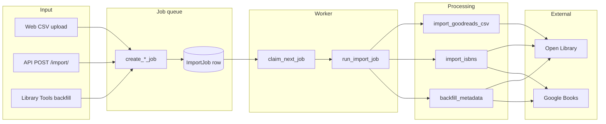
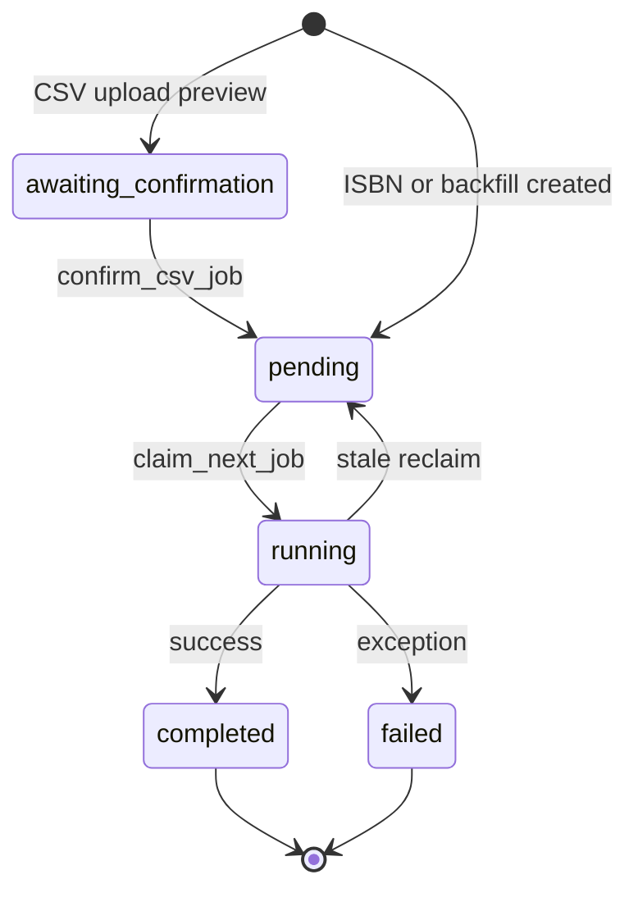

# Import and Metadata Pipeline — openbook

**Status:** Living doc | **Last updated:** 2026-06-25

---

Deep dive into background import jobs, Goodreads CSV processing, metadata lookup, and library maintenance. For deployment and worker configuration see [08-Operations-and-Deployment.md](08-Operations-and-Deployment.md). For API usage see [09-API-Consumer-Guide.md](09-API-Consumer-Guide.md). For code locations see [07-Architecture-and-Code-Map.md](07-Architecture-and-Code-Map.md).

---

## 1. Overview



All import paths create an `ImportJob` database row. A worker (background thread or `process_import_jobs` command) claims pending jobs and executes them. Progress and results are stored on the job record for polling via API or HTMX.

---

## 2. Job kinds and states

### Job kinds (`ImportJobKind`)

| Kind | Value | Trigger | Payload |
|------|-------|---------|---------|
| ISBN import | `isbns` | API `{"isbns": [...]}` or web ISBN form | `isbns` JSON array |
| Goodreads CSV | `goodreads_csv` | API file upload or web upload | `csv_file` on disk |
| Metadata backfill | `metadata_backfill` | Library Tools bulk action | `book_ids` JSON array |

### Job states (`ImportJobStatus`)



| Status | Meaning |
|--------|---------|
| `awaiting_confirmation` | Goodreads CSV uploaded; `preview` JSON populated; waiting for user confirm |
| `pending` | Queued; worker will claim |
| `running` | Worker is processing |
| `completed` | Finished; `result` JSON populated |
| `failed` | Exception; `error_message` set; partial `result` may exist |

### Job result shape

**ISBN / CSV import:**
```json
{
  "added": 42,
  "skipped": 3,
  "failed": 1,
  "errors": ["9780000000000: no metadata found"]
}
```

Errors are capped at 20 entries in the stored result.

**Metadata backfill:**
```json
{
  "updated": 30,
  "skipped": 5,
  "failed": 2,
  "errors": ["book-uuid: no ISBN"]
}
```

### Key files

| File | Role |
|------|------|
| `books/import_jobs.py` | Job creation, claiming, `run_import_job`, `serialize_job` |
| `books/import_worker.py` | Background drain thread, stale reclaim |
| `books/import_export.py` | CSV/ISBN import logic, export |
| `books/library_maintenance.py` | Backfill and per-book refresh |
| `books/management/commands/process_import_jobs.py` | CLI worker |

---

## 3. Goodreads CSV flow

### Step-by-step

1. **Upload** — User uploads Goodreads export CSV via web (`/import-export/`) or API (`POST /api/v1/import/` with `file`).
2. **Preview** — `create_csv_preview_job` saves the file to `media/import_jobs/{id}/`, parses rows into `preview` JSON, sets status `awaiting_confirmation`.
3. **Confirm** — User clicks confirm (web) or `POST /api/v1/import/jobs/{id}/` with `{"confirm": true}`. Status moves to `pending`.
4. **Process** — Worker runs `import_goodreads_csv` on the saved file.
5. **Poll** — HTMX partial or API `GET /api/v1/import/jobs/{id}/` shows progress (`progress_done` / `progress_total`).

### CSV column mapping

Goodreads export columns used by `_parse_goodreads_row`:

| CSV column | Maps to |
|------------|---------|
| `Title` | `Book.title` |
| `Author` | primary author |
| `ISBN` / `ISBN13` | `isbn_10` / `isbn_13` (handles `="..."` Excel format) |
| `Number of Pages` | `pages` |
| `Year Published` / `Original Publication Year` | `published_year` |
| `Publisher` | `publisher` |
| `My Rating` | `Review.rating` (if > 0) |
| `Exclusive Shelf` | `ReadingLog.status` |
| `Bookshelves` | custom `Shelf` tags (comma-separated) |

### Shelf-to-status mapping

| Goodreads exclusive shelf | `ReadingStatus` |
|---------------------------|-----------------|
| `to-read` | `not_started` |
| `currently-reading` | `reading` |
| `read` | `finished` |

Non-exclusive entries in `Bookshelves` become custom shelf tags (excluding `read`, `currently-reading`, `to-read`).

### Deduplication

Before creating a book, `_find_duplicate` checks in order:

1. Match by `isbn_13`
2. Match by `isbn_10`
3. Match by normalized `title|author` key

Duplicates increment `skipped` in the result. Uses `Book.all_objects` so trashed books are also matched.

### Optional metadata enrichment

When `IMPORT_GOODREADS_ENRICH_METADATA=true`, rows with an ISBN trigger an Open Library lookup to fill missing cover, genres, and other fields. Each lookup is rate-paced (see §6).

**Default (`false`):** CSV data only — fast import, no external HTTP. Use Library Tools afterward to backfill metadata.

---

## 4. ISBN import

Triggered by API `{"isbns": ["978...", ...]}` or web ISBN list form.

### Per-ISBN processing (`import_isbns`)

1. Normalize and validate ISBN checksums.
2. Skip if duplicate exists (`skipped`).
3. Call `MetadataService.lookup_isbn` (Open Library → Google Books fallback).
4. Fail if no title found (`failed`).
5. Create book via `_create_book_from_data` with metadata.
6. Update progress callback.

ISBN import **always** fetches external metadata (unlike CSV default). Books without resolvable metadata are counted as `failed`.

---

## 5. Metadata backfill

### When books need metadata

A book is eligible for backfill when it has an ISBN **and** any of:

- Missing cover URL
- Missing page count
- No authors
- No genres
- Missing publisher
- Missing published year

Query: `books_needing_metadata()` in `library_maintenance.py`.

### Enrichment rules (`enrich_book_from_metadata`)

**Only empty fields are updated** — existing data is never overwritten.

| Field type | Rule |
|------------|------|
| Scalar fields | `cover_url`, `pages`, `publisher`, `published_year`, `subtitle`, `description`, OL/GB IDs — set only if currently empty |
| Authors | Added only if book has no authors (`add_authors_to_book`) |
| Genres | Added only if book has no genres (`add_genres_to_book`) |

### Triggers

| Entry point | Creates job kind |
|-------------|------------------|
| Library Tools → bulk backfill | `metadata_backfill` |
| Book detail → Refresh metadata | Synchronous `refresh_book_metadata` (no job) |
| API | Via import job if exposed |

---

## 6. Metadata providers

### Lookup order (`MetadataService.lookup_isbn`)

1. Check Django cache (`metadata:isbn:{isbn_13}`, TTL 30 days).
2. Query **Open Library** (`/api/books?bibkeys=ISBN:...`).
3. If no title, query **Google Books** (`/volumes?q=isbn:...`).
4. Cache positive result (30 days) or negative result (1 hour).

Title/author search (`search_books`) queries both providers and merges results.

### Rate pacing

| Config | Delay between import-context lookups |
|--------|--------------------------------------|
| `METADATA_IMPORT_DELAY_SECONDS` > 0 | Custom value |
| `OPENLIBRARY_CONTACT_EMAIL` set | 0.35s (~3 req/s) |
| No contact email | 1.0s (~1 req/s) |

Import-context lookups (`import_context=True`) log at INFO level; interactive lookups log at WARNING on failure.

### User-Agent

Built by `metadata_user_agent()`:

- With email: `openbook/0.1.0 (you@example.com)`
- Without: `openbook/0.1.0 (+https://your-host)`

### Retries

Transient HTTP failures retry up to `METADATA_RETRY_COUNT` (default 1) with `METADATA_RETRY_BACKOFF` seconds between attempts. Respects `Retry-After` header (capped at 60 seconds).

### Cache storage

Metadata cache uses Django `DatabaseCache` (PostgreSQL/SQLite cache table). Clear via Library Tools → **Clear metadata cache** or `cache.delete` in admin.

---

## 7. Worker concurrency

### Job claiming (`claim_next_job`)

```sql
-- Conceptual (PostgreSQL)
SELECT * FROM books_importjob
WHERE status = 'pending'
ORDER BY created_at
FOR UPDATE SKIP LOCKED
LIMIT 1;
```

- **PostgreSQL:** `select_for_update(skip_locked=True)` — multiple workers can run safely; each claims a different job.
- **SQLite (local dev):** `select_for_update()` without skip locked — single worker only.

### Auto-process thread (local dev)

When `IMPORT_JOB_AUTO_PROCESS=true`:

1. `create_*_job` calls `transaction.on_commit(schedule_import_processing)`.
2. A daemon thread `openbook-import` runs `drain_pending_jobs()`.
3. Thread processes all pending jobs sequentially, then exits.
4. Only one drain thread runs at a time (lock guarded).

### CLI worker (Docker)

`process_import_jobs --loop` polls every 2 seconds (configurable `--interval`), reclaiming stale jobs before each attempt.

### Progress updates

During processing, `progress_done` and `progress_total` are updated on the `ImportJob` row via `_make_progress_updater`. Web UI polls via HTMX `ImportJobStatusPartialView`.

---

## 8. Web UI integration

| Feature | Implementation |
|---------|----------------|
| Import page | `/import-export/` — upload CSV or paste ISBNs |
| Job detail | `/import-export/jobs/{uuid}/` — status, result, errors |
| Live progress | HTMX partial at `.../jobs/{uuid}/status/` — auto-refreshes while `running` |
| Process now | `.../jobs/{uuid}/process/` — forces `schedule_import_processing(force=True)` |
| Library Tools | `/library-tools/` — health stats, bulk backfill, clear cache |

---

## 9. Failure modes

| Scenario | Behaviour |
|----------|-----------|
| Single row fails in CSV | Row counted in `failed`; other rows continue; error in `result.errors` |
| Entire job crashes | Status `failed`; `error_message` set; partial `result` if available |
| Worker dies mid-job | Job stays `running` until `IMPORT_JOB_STALE_MINUTES` elapses, then reclaimed to `pending` |
| No metadata for ISBN | `failed` with `"no metadata found"` |
| Duplicate ISBN | `skipped` |
| Book without ISBN in backfill | `skipped` or `failed` with `"no ISBN"` |
| Open Library rate limit | Retry with backoff; may slow entire job |
| Upload too large | HTTP 413 `payload_too_large` (Django `DATA_UPLOAD_MAX_MEMORY_SIZE`) |

### Idempotency

Re-importing the same ISBN or CSV row increments `skipped`, not `added`. Safe to retry failed jobs after fixing configuration (e.g. setting `OPENLIBRARY_CONTACT_EMAIL`).

---

## 10. Export (related)

Export is synchronous (no job queue):

| Format | Endpoint | Content |
|--------|----------|---------|
| JSON | `GET /api/v1/export/?format=json` | Full fidelity — all fields, shelves, reviews, reading logs |
| CSV | `GET /api/v1/export/?format=csv` | Goodreads-compatible columns for round-trip |

Implemented in `books/import_export.py` (`export_json`, `export_csv`).

---

## 11. Related docs

- [08-Operations-and-Deployment.md](08-Operations-and-Deployment.md) — worker setup, env vars
- [09-API-Consumer-Guide.md](09-API-Consumer-Guide.md) — import API curl examples
- [07-Architecture-and-Code-Map.md](07-Architecture-and-Code-Map.md) — module map
- [05-Backend-Schema.md](05-Backend-Schema.md) — `ImportJob` table definition
